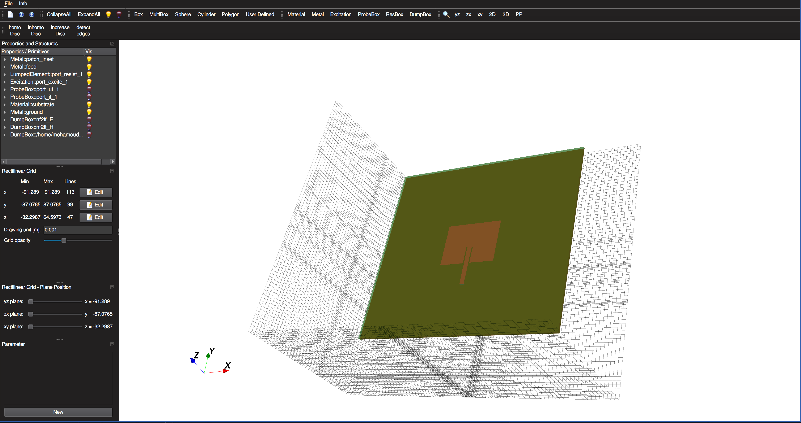

# simpleEMS
[](https://www.gnu.org/licenses/agpl-3.0)
[](https://pypi.org/project/project-name/)
[](https://www.python.org)
simpleEMS is a python library built on top of [openEMS](https://openems.readthedocs.io/en/latest/) to make the design of antennas and other RF structures simpler.

## Motivation
As an Electronic Engineer, I wanted to create an accessible, open-source tool for antenna design, particularly for professional Electronic Engineers, freelancers and hobbyists.
Many proprietary design tools offer limited functionality in their free versions, often restricting memory and making them impractical for serious designs.
After working with openEMS for FDTD simulations, I saw an opportunity to build a more flexible and user-friendly solution.
This Python package leverages openEMS to provide a cost-effective, scalable alternative for simulating, optimizing, and visualizing antenna and other RF designs,
empowering engineers to work on more complex projects without the constraints of proprietary software.
## Key Features:

### **Antenna Design**
- Inset-Fed Patch Antenna Design
- Probe-Fed Patch Antenna Design

### **Simulation & Optimization**
- Parameter Sweep
- S11 Optimization

### **Network Parameters Calculation**
- S11 (Reflection Coefficient)
- VSWR (Voltage Standing Wave Ratio)
- Z11 (Input Impedance)
- Input Power

### **Visualization & Plotting**
- Geometry Structure Visualization
- S11 Plotting
- VSWR Plotting
- Smith Chart for S11
- Complex Impedance (Z11) Plotting
- 2D Radiation Pattern
- 2D Directivity Plot
- 3D Radiation Pattern, Gain & Power Plot

### **Field Dump**
- Field Dump for ParaView
  - E-Field (Time and Frequency Domain)
  - H-Field (Time and Frequency Domain)
  - Current Density (Time and Frequency Domain)

### **Export Options**
- Gerber Export
- STL Export
- Touchstone S1P Export

## Demo
Below is a design of 2.45GHz Inset-Fed patch antenna
```
#!/usr/bin/env python3
from pathlib import Path
from simpleEMS import (
    InsetPatchParams,
    InsetFedPatchAntenna,
    setup_simulation,
)


output_path = Path(__file__).with_suffix("")
output_path.mkdir(parents=True, exist_ok=True)

params = InsetPatchParams(
    resonant_freq=2.45e9,
    corner_freq=0.5e9,
    substrate_thickness_mm=1.6,
    substrate_eps_r=4.4,
    substrate_tand=0.001,
    charac_imp=50,
)

CSX, FDTD = setup_simulation(params)

patch = InsetFedPatchAntenna(params, CSX, FDTD)
patch.print_and_save_params(params, output_path)
patch.create_patch_with_inset()
patch.create_feed()
port = patch.create_port()
patch.create_substrate()
patch.create_ground()
patch.create_mesh()
nf2ff = patch.create_nf2ff(FDTD)
patch.add_field_dump(CSX, params, output_path)
patch.write_and_show_structure(CSX, output_path)

network_params = None

patch.run_simulation(FDTD, output_path)

network_params = patch.compute_network_params(port, params, output_path)
nf2ff_3d_result = patch.compute_nf2ff_3d(nf2ff, params.resonant_freq, output_path)
patch.plot_s11(network_params.freqs, network_params.s11)
patch.plot_smith_chart(network_params.freqs, network_params.s11)
patch.plot_vswr(network_params.freqs, network_params.vswr)
patch.plot_impedance(network_params.freqs, network_params.z11)
patch.plot_2d_directivity(nf2ff, params.resonant_freq, output_path)
patch.plot_2d_rad_pattern(nf2ff, params.resonant_freq, output_path)
patch.plot_3d_directivity(nf2ff_3d_result, params.resonant_freq, output_path)
patch.plot_3d_gain(
    nf2ff_3d_result,
    params.resonant_freq,
    network_params.input_power,
    output_path,
)
patch.plot_3d_power(nf2ff_3d_result, params.resonant_freq, output_path)
patch.save_plots(output_path)
patch.show_plots()
patch.export_stl(output_path)
patch.export_touchstone(network_params, output_path)
patch.export_gerber(
    CSX,
    output_path,
    options={"ignore": ["ground"]},
)

```
Below is a visualisation of the model created by the above code

The result of the simulation

## Installation


