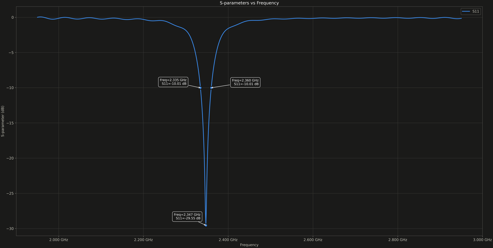
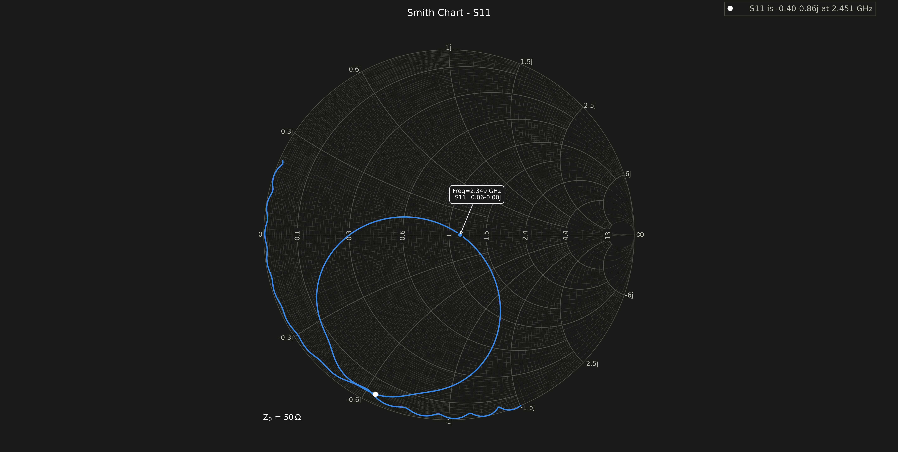
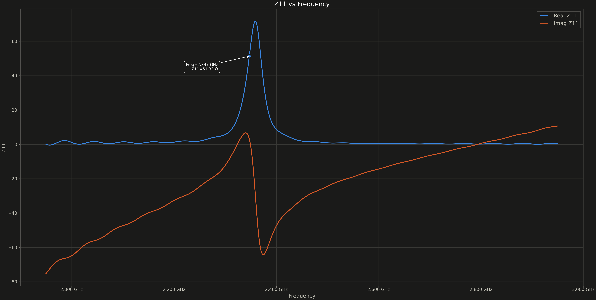
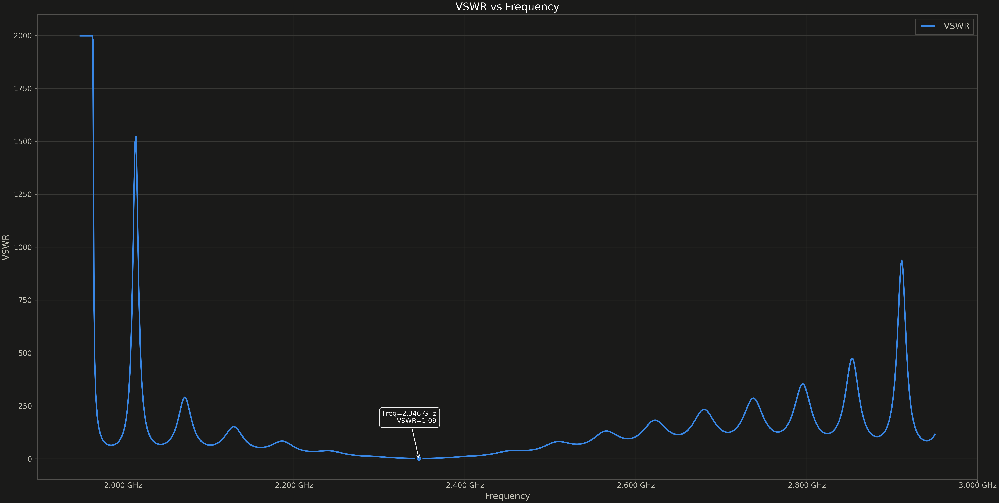
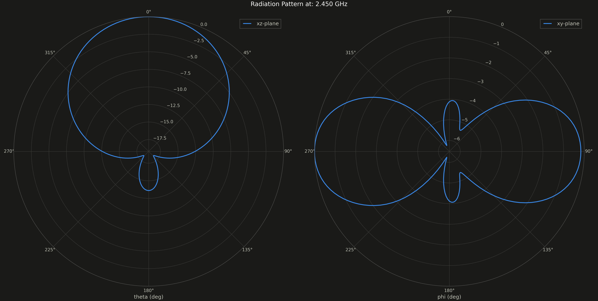
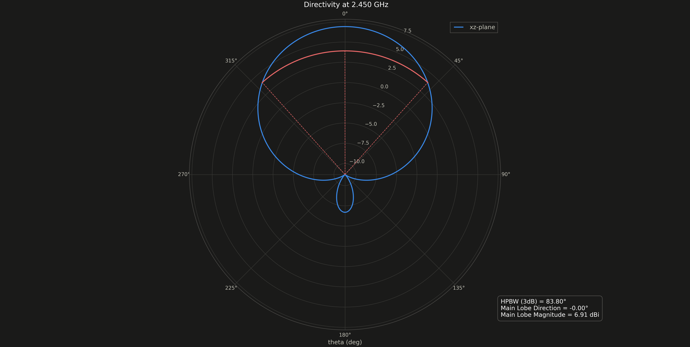
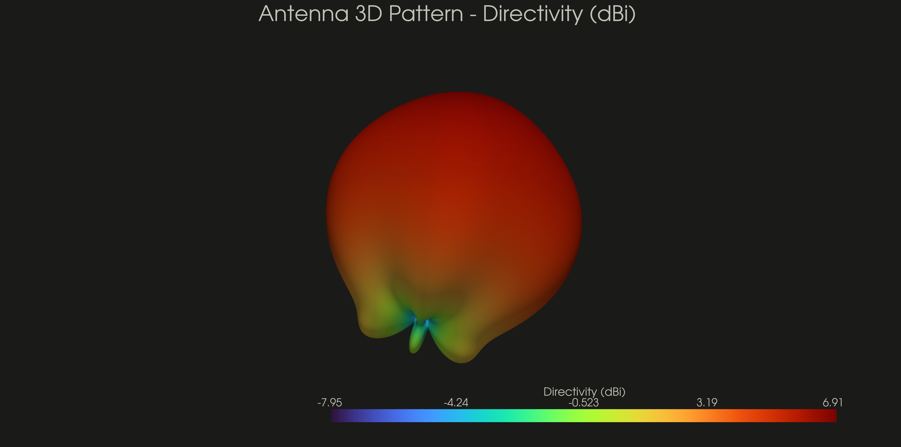
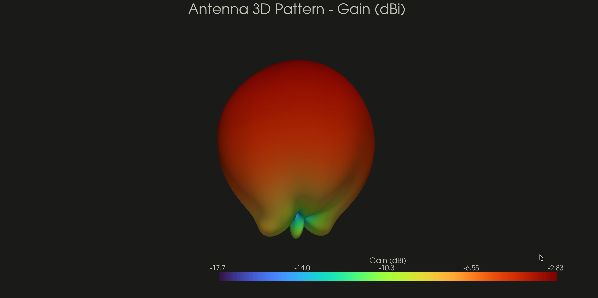
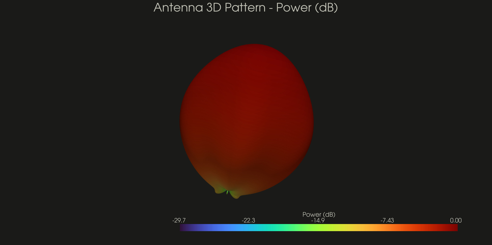

# simpleEMS
[](https://www.gnu.org/licenses/agpl-3.0)
[](https://pypi.org/project/simpleEMS/)
[](https://www.python.org)

simpleEMS is a python library built on top of [openEMS](https://openems.readthedocs.io/en/latest/) to make the design of antennas and other RF structures simpler.

## Motivation

This Python package provides an alternative to proprietary suites with expensive licenses or the restrictive "Student" versions such as CST, HFSS and Sonnet
which often impose stifling mesh cell limits and memory caps. By leveraging the openEMS FDTD engine, it offers a scalable framework for simulating, optimizing, and
visualizing complex RF designs. whether you are a professional engineer, a freelancer, or a dedicated hobbyist,
this library will enable you to design RF circuits easily.

## Key Features:

### **Antenna Design**
- Inset-Fed Patch Antenna Design
- Probe-Fed Patch Antenna Design

### **Filter Design**
- Bandpass Quarter-Wave Filter Design
- Bandstop Quarter-wave Filter Design

### **Simulation & Optimization**
- Parameter Sweep
- S11 Optimization
- S21 Optimization

### **Network Parameters Calculation**
- S11 (Reflection Coefficient)
- S21 (Insertion Loss)
- VSWR (Voltage Standing Wave Ratio)
- Z11 (Input Impedance)
- Input Power

### **Visualization & Plotting**
- Geometry Structure Visualization
- S11 Plotting
- S21 Plotting
- VSWR Plotting
- Smith Chart for S11
- Complex Impedance (Z11) Plotting
- 2D Radiation Pattern
- 2D Directivity Plot
- 3D Radiation Pattern, Gain & Power Plot

### **Field Dump**
- Field Dump for ParaView
  - E-Field (Time and Frequency Domain)
  - H-Field (Time and Frequency Domain)
  - Current Density (Time and Frequency Domain)

### **Export Options**
- Gerber Export
- STL Export
- Touchstone SnP Export

## Demo
[This example](https://github.com/MohamoudAli12/simpleEMS/blob/master/examples/simple_inset_fed_patch_antenna.py) creates an inset fed patch antenna and simulates the created model.

```{literalinclude} ../../examples/simple_inset_fed_patch_antenna.py
```

Below is a visualisation of the model created by the above code


The result of the simulation



















## Installation

Refer to the installation instructions in the [docs](https://mohamoudali12.github.io/simpleEMS/user/installation.html).

