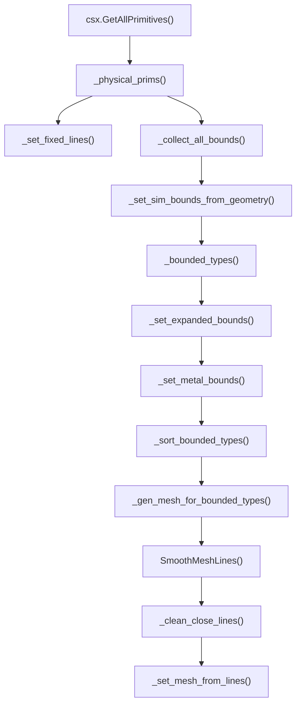
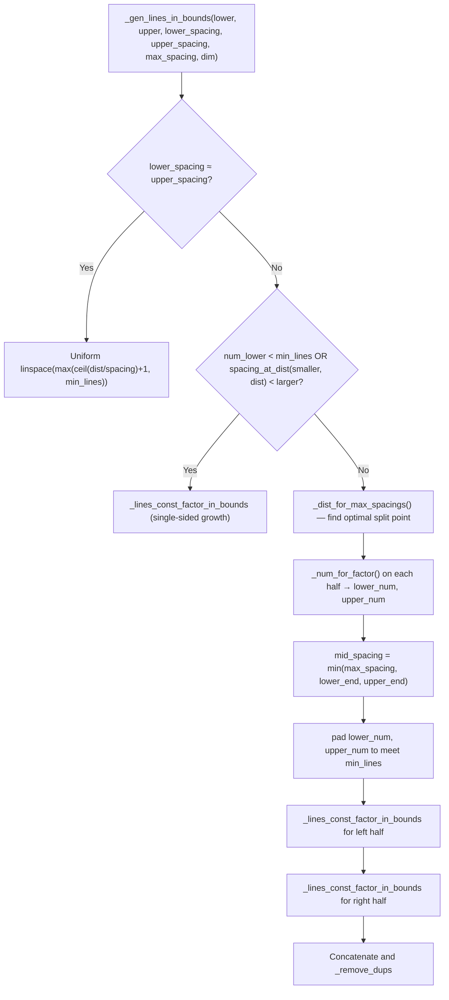
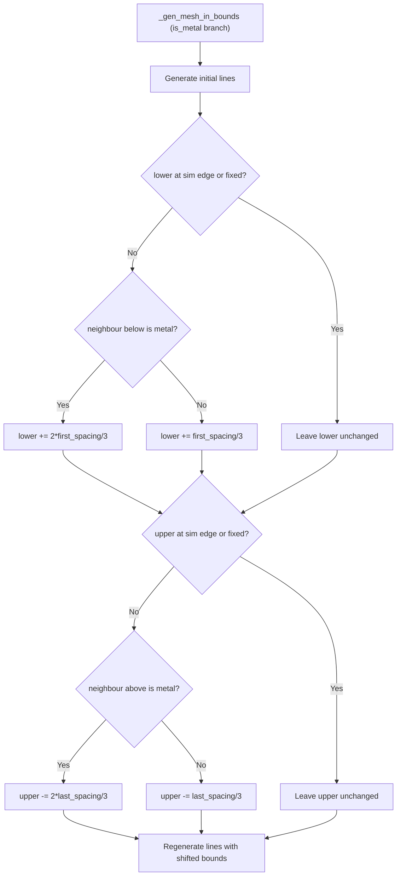
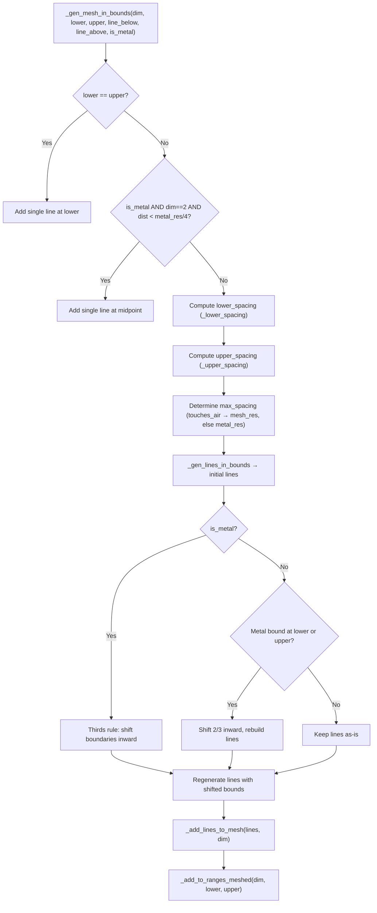
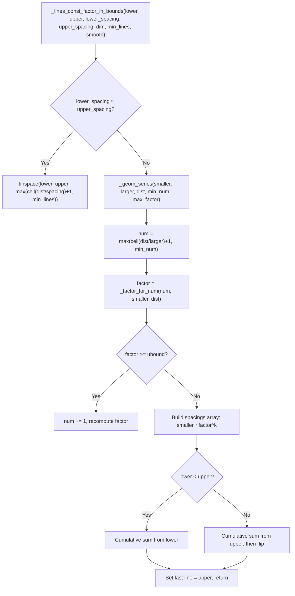

# `mesh.py` — Algorithm Documentation

A thorough explanation of the FDTD auto-meshing algorithm implemented in `mesh.py`. Adapted from [pyems](https://github.com/edward-kay/pyems). All dimensions are in the project's geometry unit (default `unit = 1e-3`, i.e. **millimetres**).

---

## 0. Goal

`Mesh` takes a CSXCAD `ContinuousStructure` (populated with primitives) and generates a Cartesian FDTD grid. The pipeline:



1. collect bounding-box boundaries from all physical primitives (including linpoly vertices)
2. classify each inter-boundary region as metal / nonmetal / air
3. generate mesh lines per region using geometric series
4. apply the "thirds rule" at metal boundaries
5. merge nearly-coincident lines
6. globally smooth with CSXCAD's `SmoothMeshLines`

The constructor (`__init__`, line 387) stores parameters and calls `_generate()` (line 412). All logic is in `_generate()`.

```python
def _generate(self) -> None:
    prims = self._csx.GetAllPrimitives()
    physical_prims = _physical_prims(prims)
    self._set_fixed_lines(physical_prims)
    bounds = _collect_all_bounds(physical_prims, self.fixed_lines)
    self._set_sim_bounds_from_geometry(bounds)
    bounded_types = self._bounded_types(bounds, physical_prims)
    bounded_types = self._set_expanded_bounds(bounded_types)
    self.bounded_types = bounded_types
    self._set_metal_bounds(bounded_types)
    size_ordered = _sort_bounded_types(bounded_types)
    self._gen_mesh_for_bounded_types(size_ordered)
    self._set_mesh_from_lines()
    self.mesh.SmoothMeshLines("all", self._mesh_res, self._smooth[0])
    self._clean_close_lines()
```

---

## 1. Floating-point helpers (lines 19, 47–68)

`PREC = 10` rounds every comparison to 10 decimal places. This prevents floating-point drift between CSXCAD's geometry engine and the mesh generator.

| helper | meaning |
|--------|---------|
| `fp_nearest` | round to `PREC` |
| `fp_equalp` | equal up to `PREC` |
| `fp_gtp` / `fp_gep` | strictly greater / greater-or-equal |
| `fp_ltp` / `fp_lep` | strictly less / less-or-equal |

---

## 2. Primitive classification (lines 22–44, 71–95)

Two predicates on a CSXCAD primitive:

- `_prim_metalp` (line 71) → type string in `{"Metal", "ConductingSheet", "LumpedElement"}`
- `_prim_materialp` (line 76) → `"Material"`

Only these are considered **physical** primitives — ports, excitation, etc. are ignored.

`Type` (line 22) is the region classification enum: `metal=0`, `nonmetal=1`, `air=2` (`None` returned from `_type_at_pos` is also treated as air).

`BoundedType` (line 28) wraps a `[lower, upper]` interval with a `Type` and exposes `get_midpoint()` and `size()`.

---

## 3. Geometry discovery

### 3.1 Bounding boxes (`_get_prim_bounds`, line 80)
Returns the AABB of a primitive in **world coordinates**:
1. asks CSXCAD for the local AABB (`prim.GetBoundBox()`),
2. transforms both corners through `prim.GetTransform()`,
3. takes per-axis min/max.

### 3.2 Boundary pool (`_collect_all_bounds`, line 162)

Collects all geometry boundaries per axis:
- For every physical primitive, appends both AABB lower and upper bounds.
- For `CSPrimLinPoly` / `CSPrimPolygon` primitives (`_is_linpoly`, line 93), also extracts all vertex coordinates via `_get_linpoly_vertex_bounds` (line 98) — this ensures polygon vertices away from the AABB corners are captured as mesh candidates.
- Sorts and deduplicates per axis, preferring to keep `fixed` lines (see §4).

The earlier `_bounds_from_prims` (line 147) is present but **not called** by `_generate` — it only uses AABB corners. `_collect_all_bounds` is the active code path.

### 3.3 Region classification (`_bounded_types`, line 441; `_type_at_pos`, line 190)
With sorted boundaries `[b₀, b₁, b₂, …]` per axis, walks consecutive pairs `(bᵢ, bᵢ₊₁)` and classifies via `_type_at_pos()` at the midpoint.

There is special handling for **fixed-line boundaries** (line 448): if a bound is also a fixed line, a zero-width `BoundedType` is created at that exact position (so zero-thickness metals are represented as single-point regions). The previous region is closed at the fixed line before the zero-width region, ensuring correct adjacency.

`_type_at_pos` resolves overlapping primitives with a **smallest-extent wins** rule (line 190):
- checks every primitive whose AABB contains the test point,
- the smallest-extent primitive (along the test dimension) wins,
- ties (within `rtol=1e-3`) prefer **metal**.

### 3.4 Adjacency queries (lines 538–560)
- `_type_below(dim, upper)` (line 538) → type of the region whose upper bound equals `upper`
- `_type_above(dim, lower)` (line 550) → type whose lower bound equals `lower`
- `_type_below_meshed` / `_type_above_meshed` (lines 544, 556) → whether that region has already been meshed

These are used during spacing computation and the thirds rule to detect metal–metal vs metal–nonmetal adjacencies.

---

## 4. Fixed lines (`_set_fixed_lines`, line 428)

A **fixed line** is a mesh position locked in place — smoothing will not move it. Added by `_set_fixed_lines`:
- for every physical primitive, if its AABB is degenerate on any axis (`lower == upper`), that coordinate is added as a fixed line.

This pins the planes of **2D primitives** (zero-thickness sheets, ports, LumpedElements) into the mesh.

`add_fixed_line` (line 437) is also available as a public method for external callers.

---

## 5. Simulation box (`_set_sim_bounds_from_geometry`, line 465)

The user-supplied `simulation_box` is a starting point. It gets **overridden** by a box grown from the actual geometry:

```python
span = geo_max - geo_min
padding = max(lambda0 / 2, span * 0.15)
new_box = (geo_min - padding, geo_max + padding)
```

This guarantees at least λ₀/2 of air padding around the structure (standard for PML absorption).

### 5.1 Expansion to fill the box (`_set_expanded_bounds`, line 478)

Prepends/appends `Type.air` regions to fill any gap between the sim box and the outermost geometry. Raises `ValueError` if the final sim box is smaller than the geometry (with a message naming the offending dimension and required interval). Caches the final bounds as `self.sim_bounds[dim]`.

After this, every position from `sim_box.lower` to `sim_box.upper` on every axis is covered by a `BoundedType`.

### 5.2 Metal bounds (`_set_metal_bounds`, line 511)
Records every metal region's `[lower, upper]` endpoints for use in the thirds rule. Zero-width metal bounded types (from fixed-line degeneracy on 2D primitives) are excluded.

---

## 6. Per-region meshing

### 6.1 Processing order

Regions are sorted **by size, smallest first** (`_sort_bounded_types`, line 207). Small features (thin metals, narrow gaps) are meshed first so adjacent larger regions can see their lines and maintain smooth transitions.

`_gen_mesh_for_bounded_types` (line 565) iterates each region:

```python
for each (dim, btype):
    lower, upper = bounds
    line_below = nearest existing mesh line strictly below lower
    line_above = nearest existing mesh line strictly above  upper
    _gen_mesh_in_bounds(dim, lower, upper, line_below, line_above, is_metal)
    mark range as meshed
```

### 6.2 Spacing computation (`_lower_spacing` / `_upper_spacing`, lines 583–621)

Each end of the region gets a target cell spacing:

1. **Base resolution**: `metal_res` if metal, else `mesh_res`.
2. **Min-spacing clamp**: `min(base, dist / (min_lines - 1))` prevents fewer cells than `min_lines=5`.
3. **Adjacent-region constraint**: if the neighbour has already been meshed, the spacing is capped at `factor * (distance to neighbour line)` where:
   - `factor = 1.0` — default (no special interface)
   - `factor = 1.5` — at a **non-fixed** metal–nonmetal boundary (gentle growth)
   - `factor = 3.0` — at a **non-fixed** metal–air or metal–metal boundary (faster growth)
4. **z-dimension floor** (lines 599–600, 619–620): if `dim == 2`, spacing is clamped to at least `mesh_res / 5`. This prevents excessively fine cells in the vertical direction when very close mesh lines exist from adjacent regions.

```python
# Inside _lower_spacing (line 599)
if dim == 2:
    lower_spacing = np.max([lower_spacing, self._mesh_res / 5])
```

These spacings are **consumed**: they are passed directly into `_gen_lines_in_bounds`.

### 6.3 Thin z-metal special case (lines 650–652)

```python
elif is_metal and dim == 2 and dist < self._metal_res / 4.0:
    mid = fp_nearest((lower + upper) / 2.0)
    self._add_lines_to_mesh(np.array([mid]), dim)
```

If a metal region in the vertical dimension is thinner than one boundary cell (`metal_res / 4`), the full geometric series and thirds rule are skipped. A **single mesh line** is placed at the midpoint. This prevents sub-cell copper foils from generating many unnecessary lines.

### 6.4 Maximum spacing with air adjacency (lines 635–646)

After computing lower/upper spacings, the `max_spacing` cap is determined by **whether the metal touches air**:

```python
if is_metal:
    below_type = self._type_below(dim, lower)
    above_type = self._type_above(dim, upper)
    touches_air = (
        below_type is None
        or below_type == Type.air
        or above_type is None
        or above_type == Type.air
    )
    max_spacing = self._mesh_res if touches_air else self._metal_res
else:
    max_spacing = self._mesh_res
```

If a metal region borders air on either side, its cells cap at the coarser `mesh_res` instead of `metal_res`. This prevents unnecessarily fine meshing deep inside large metal structures that are exposed to air on one face only.

### 6.5 Line generation (`_gen_lines_in_bounds`, line 705)

The core mesh-line generator for a region `[lower, upper]` with target spacings at each end.



**If spacings are equal** (within 1e-3 rel tolerance):
```python
num_lines = max(ceil(dist / spacing) + 1, min_lines)
return linspace(lower, upper, num_lines)
```

**If spacings differ**, a bidirectional geometric series is constructed:

1. Check if the distance is small enough for a single const-factor series (lines 719–732). If so, delegate to `_lines_const_factor_in_bounds`.
2. Otherwise, find the optimal split point `midpt` where the two series meet, via `_dist_for_max_spacings` (line 326).
3. Grow from `lower_spacing → mid_spacing` on the left, and `mid_spacing → upper_spacing` on the right.
4. `mid_spacing` is capped at `max_spacing` (which itself depends on metal/air adjacency, §6.4).
5. Each half is generated by `_lines_const_factor_in_bounds` (line 272): starting from the boundary, each subsequent cell is `spacing * factor^k` until the target spacing is reached, with the growth factor bound by `smooth_ratio`.

### 6.6 Geometric series mathematics

Given `num - 1` cells growing geometrically from `small_spacing` by factor `factor`:

```
dist = small_spacing · Σ(factor^k),  k = 1 … num-1
```

```python
def _factor_for_num(num: int, smaller_spacing: float, dist: float) -> float:
    roots = scipy.optimize.fsolve(
        func=_geom_dist_zero, x0=1.5, args=(num, smaller_spacing, dist)
    )
    return roots[0]
```

`_geom_series` (line 257) determines the minimal `num` such that the growth factor does not exceed the `smooth_ratio` limit and does not overshoot the target `larger_spacing`.

`_num_for_factor` (line 238) inverts the geometric sum to predict how many cells are needed given a known factor, spacing, and distance.

`_dist_for_max_spacings` (line 326) finds the optimal meeting point for two opposing series by solving `_spacings_at_dist_zero(dist) = 0`:

```python
def _dist_for_max_spacings(
    lower_spacing: float, upper_spacing: float, dist: float, max_factor: float
) -> float:
    roots = scipy.optimize.fsolve(
        func=_spacings_at_dist_zero,
        x0=dist / 2,
        args=(lower_spacing, upper_spacing, dist, max_factor),
    )
    return roots[0]
```

It converges on the position `d` in `[0, dist]` where `spacing_at_dist(lower_spacing, d)` equals `spacing_at_dist(upper_spacing, dist - d)` — giving a symmetric interface.

### 6.7 Thirds rule for metals (lines 658–685)

After initial line generation, the metal boundaries are shifted to place mesh lines at 1/3 and 2/3 offsets from the metal edge:

```python
if lower not at sim-box edge and not fixed:
    if neighbour below is also metal (already meshed):
        lower += 2 * first_spacing / 3    # further in — neighbour has lines
    else:
        lower += first_spacing / 3         # 1/3 inside the metal
```

Same logic for the upper boundary. Lines are then **regenerated** with the shifted bounds.

The resulting cell at the metal boundary is `first_spacing / 3 + 2 * last_spacing / 3` (or vice versa), giving the canonical 1/3–2/3 split for FDTD accuracy.



### 6.8 Thirds rule for nonmetals (lines 686–701)

If a nonmetal region abuts a metal boundary, the boundary is shifted **inward** by `2 * spacing / 3`:

```python
if metal_bound_at(lower):
    spacing = min(first_spacing, metal_res)
    lower += 2 * spacing / 3
if metal_bound_at(upper):
    spacing = min(last_spacing, metal_res)
    upper -= 2 * spacing / 3
```

Together with the metal-side shift (§6.7), this creates the complementary cell: the metal occupies 1/3 of the boundary cell, the nonmetal occupies 2/3 — placing a mesh line at the metal surface.

---

## 7. Post-processing: clean close lines (`_clean_close_lines`, line 783)

After all regions are meshed and smoothed, a coalescence pass merges mesh lines that are extremely close together (within 1% of `smallest_res`):

```python
def _clean_close_lines(self, min_spacing: float | None = None) -> None:
    if min_spacing is None:
        min_spacing = self.smallest_res * 0.01
    for dim in range(3):
        lines = list(self.mesh.GetLines("xyz"[dim]))
        # walk pairs; if gap < min_spacing, merge:
        #   - if one is a fixed line, keep that one
        #   - otherwise replace with average
```

This handles edge cases where the thirds rule or adjacent geometric series produce lines within sub-percentage distances — below what the simulation would resolve. The merged positions are deduplicated and written back to the grid.

---

## 8. Smoothing (line 425)

After all regions are meshed and close lines cleaned, a single global smoothing pass is applied:

```python
self.mesh.SmoothMeshLines("all", self._mesh_res, self._smooth[0])
```

- `"all"` — applies to all dimensions
- `self._mesh_res` — the global target cell size
- `self._smooth[0]` — the maximum ratio between adjacent cells (default 1.5)

`SmoothMeshLines` **preserves all existing points** (fixed lines, thirds-rule anchors, region boundaries) and adds intermediate points wherever adjacent cell sizes exceed the ratio limit. This stitches together regions of different densities (coarse air → fine metal-edge) into a smooth progression.

---

## 9. Grid assembly (`_set_mesh_from_lines`, line 773)

```python
grid = self._csx.GetGrid()
grid.SetDeltaUnit(self._unit)
for i in range(3):
    grid.ClearLines(i)
for dim in range(3):
    for line in self.mesh_lines[dim]:
        grid.AddLine('xyz'[dim], fp_nearest(line))
```

All values are pre-rounded to `PREC` (10 decimal places). The grid unit is set explicitly so CSXCAD interprets coordinates correctly.

---

## 10. State accumulated on `self`

| Attribute | Type | Purpose |
|-----------|------|---------|
| `sim_bounds[dim]` | `[float, float]` | Final `[lower, upper]` per axis after geometry expansion |
| `ranges_meshed[dim]` | `list[[float, float]]` | Intervals already populated; used by `_pos_meshed` |
| `metal_bounds[dim]` | `list[float]` | Every metal region's boundary positions |
| `fixed_lines[dim]` | `list[float]` | Locked positions: zero-thickness primitives, thirds-rule anchors |
| `mesh_lines[dim]` | `list[float]` | The final per-axis mesh lines (sorted, deduplicated) |
| `bounded_types[dim]` | `list[BoundedType]` | Region list with types (cached for adjacency queries) |
| `smallest_res` | `float` | Set to `_metal_res`; used as default `min_spacing` in `_clean_close_lines` |
| `mesh` | `CSXCAD grid` | Alias for `csx.GetGrid()` |

---

## 11. Key design decisions

1. **Smallest-first processing order** (`_sort_bounded_types`) ensures thin features are meshed before bulk regions, so neighbour-aware spacing constraints in `_lower_spacing`/`_upper_spacing` see the correct adjacent lines.

2. **Smallest-AABB-wins classification with metal tiebreak** (`_type_at_pos`) handles overlapping primitives robustly — a thin metal patch inside a thick substrate is correctly classified as metal.

3. **Geometric series for grid transitions** — rather than uniform spacing, cells grow geometrically from a fine boundary spacing to a coarser interior spacing, with the growth factor bounded by `smooth_ratio=1.5`. This provides natural mesh grading.

4. **Bidirectional geometric series** — when lower and upper spacings differ, the two series meet at an interior point where both reach the same cell size, ensuring symmetry when adjacent metal features demand fine resolution at both ends.

5. **Fixed lines as anchors** — zero-thickness primitives (sheets, ports, LumpedElements) are pinned as fixed lines, and the thirds rule marks its offset lines as fixed. Everything else is fair game for smoothing to adjust.

6. **Thin z-metal special case** — copper foils thinner than `metal_res / 4` in the vertical dimension get a single line at midpoint rather than the full geometric series + thirds rule treatment.

7. **Air-touching metals use mesh_res** — if a metal region borders air on either face, its interior `max_spacing` is capped at `mesh_res` instead of `metal_res`, preventing unnecessarily dense meshing deep inside large metal patches exposed to air.

8. **Close-line coalescence** — `_clean_close_lines` merges lines within 1% of `smallest_res` to prevent sub-resolution features from generating extra cells.

9. **Global SmoothMeshLines** — a single call on all axes simultaneously ensures cross-axis consistency. It only adds points, never removes or moves the input lines.

10. **Sim box is grown from geometry** — the user-supplied `simulation_box` is a minimum; it expands by `max(λ₀/2, 15% × span)` around the geometry. If the geometry exceeds the given box, a `ValueError` is raised.

11. **`_lower_spacing`/`_upper_spacing` are consumed** — unlike earlier versions of this code, the spacing values computed by these methods are passed directly to `_gen_lines_in_bounds` and actively control the mesh density.

12. **`PREC=10` round-trip on every float** prevents floating-point misalignment between geometry and mesh. "Two positions are the same" is defined as "they agree to 10 decimal places".

---

## 12. Query helpers (`nearest_mesh_line`, `_line_below`, `_line_above`, lines 817–869)

`nearest_mesh_line` (line 817) bisects the sorted `mesh_lines[dim]` and returns the closest line (by absolute distance). `_line_below` (line 836) and `_line_above` (line 852) return the nearest line **strictly** below or above the given position, walking past any exact match. These are used by `_gen_mesh_for_bounded_types` to find existing neighbour lines when constraining spacing.

---

## 13. Overview of per-region meshing



---

## 14. Geometric series flow


